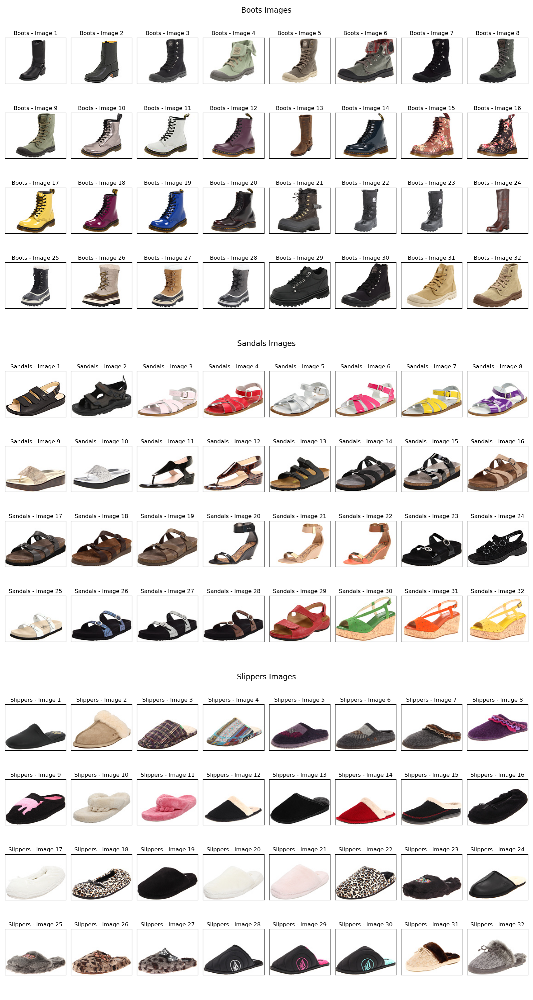

# E-Commerce_SHOES_Classification_CNN_Model

E-commerce has rapidly grown and their business strategies are completely based on user actions and user experiences. Although it is completely based on users, there is also a technology bridge between users and growth in business. It may be Machine Learning or Deep Learning. Companies apply many image classification techniques data to improve their catalog and give the best suggestions to the users. They need accurate product classification on their platforms for better user experience. But when you talk about products, there exists a huge variety, and classifying within varieties is challenging. As a Deep Learning engineer, you should always try cracking these challenges by classifying things within a product.

**Goal:** Given the images of a product with multiple categories, train a model that can classify the product type.

**Data Description:** Data is all about images of shoes with multiple categories and data is collected from a popular E-commerce site. The data set consists of two folders train and test.

## Provided Files:
**Train:** The train set consists of images belonging to 3 different categories of shoes in 3 different folders: Boots, Sandals, and Slippers.

  

**Test:** The test set consists of images belonging to all 3 categories of shoes in a single folder.

## Instructions:
1. A train set should be used to feed the model.
2. A test set should be used to predict labels for test data.
   
**Evaluation Criteria:** The evaluation metric for this problem statement is the Accuracy score where each shoe category is matched with the actual shoe label.
